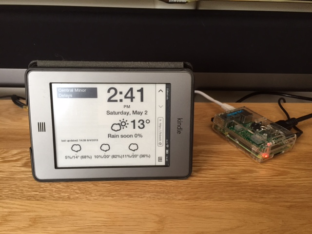

# Oldfield Frame

udo npm install git://github.com/bencevans/node-sonos.git

Oldfield frame is a tube delay and weather station designed to be run on node.js and kindle. It can be hosted on a Rasberry Pi, Qnap NAS or web service such as heroku.

The frame fits a kindle touch perfectly and will display London Underground tube delays, the current weather conditions and temperature as well as the next 5 days forecast with change of rain.

The tube delays and weather update every 60 seconds

It's designed to pull as little power as possible and run from the kindle experimental browser.

### Version
0.0.1

### Installation

Configure your forecast_io_dev key (https://developer.forecast.io/register)
 and location a file called config.json in the root of the source tree.

#### config.json
<pre><code>
{   "FORCAST_IO_API_KEY" : "MY_KEY",  
    "latitude" : "0.0",
    "longitude" : "0.0"
}
</code></pre>

Install node and npm

$npm install

$node app.js

You can disable the screen saver on kindle touch by going to the main search and typing

;debugon

followed by

~ds

Then on the Kindle go to the browser and load the location of your node server

http://mynodejsserver:3000

Enjoy.
